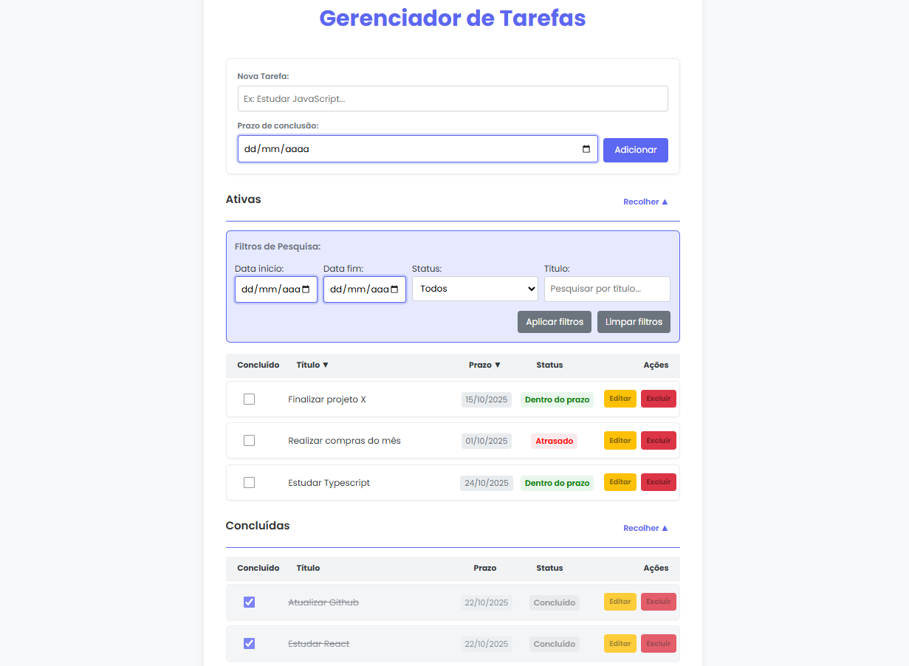

# Documentação de Bugs e Melhorias - Gerenciador de Tarefas  

<div align="center">
  
</div>


---
## Índice

1. [Bugs Encontrados e Soluções](#bugs-encontrados-e-soluções)
2. [Melhorias Implementadas](#melhorias-implementadas)
3. [Resumo de Mudanças](#resumo-de-mudanças)
4. [Tecnologias Utilizadas](#tecnologias-utilizadas)
5. [Como Executar o Projeto](#como-executar-o-projeto)

---

## Bugs Encontrados e Soluções

### 1. Problemas de configuração do projeto

- **Sintoma:**
    - Ao rodar `npm install` dentro da pasta `backend`, ocorreu o erro:
        ```
        npm error enoent Could not read package.json
        ```
    - O repositório não possuía um `.gitignore`, o que poderia fazer com que `node_modules/` ou arquivos locais (como `tasks.json`) fossem versionados.

- **Causa:** Falta de arquivos de configuração básicos: `package.json` e `.gitignore`.

- **Solução:**
    1. Criei `package.json` e instalei dependências:
        ```bash
        cd backend  
        npm init -y  
        npm install express cors  
        npm install --save-dev nodemon
        ```
    2. Incluí `scripts` no `package.json`:
        ```json
        "scripts": {  
          "start": "node server.js",  
          "dev": "nodemon server.js"
         }
        ```
    3. Adicionei `.gitignore` com as entradas básicas para Node.js e arquivos locais:
        ```
        node_modules/
        tasks.json
        .env
        npm-debug.log
        ```

- **Passo a passo do debugging:**
    1. Confirmei a ausência do `package.json` ao tentar rodar `npm install`
    2. Rodei `npm init -y` para criar o arquivo
    3. Instalei as dependências necessárias: `express`, `cors` e `nodemon`
    4. Criei o `.gitignore` para evitar versionamento de arquivos desnecessários

---

### 2. Arquivo `tasks.json` inexistente

- **Sintoma:** Ao acessar `GET /api/tasks` o backend retornava erro 500 e o frontend disparava o alerta `Erro ao carregar tarefas. Verifique se o servidor está rodando.`

- **Causa:** `tasks.json` não existia no diretório `backend` e o trecho do código responsável por criar o arquivo estava comentado.

- **Solução:** Reativei a criação automática do arquivo no topo de `server.js`:
    ```javascript
    const DATA_FILE = path.join(__dirname, 'tasks.json');
    if (!fs.existsSync(DATA_FILE)) {
      fs.writeFileSync(DATA_FILE, JSON.stringify([]));
    }
    ```

- **Observação:** manter `tasks.json` no `.gitignore` evita commits de dados locais que causariam conflitos entre desenvolvedores.

- **Passo a passo do debugging:**
    1. Com o `package.json` pronto, rodei `npm install` e `npm run dev`
    2. Verifiquei no terminal a mensagem `Servidor rodando na porta 3000`
    3. Abri o `index.html` e observei o alerta de erro
    4. Abri o console do navegador (F12) e capturei:
        ```
        GET http://localhost:3000/api/tasks net::ERR_CONNECTION_REFUSED
        Erro ao carregar tarefas: loadTasks @ script.js
        ```
    5. Inspecionei `server.js` e encontrei o trecho comentado que criava `tasks.json`
    6. Reativei o código de criação automática do arquivo
    7. Adicionei `console.log()` nas rotas e `console.error(err)` nos `catch` para debugging

---

### 3. Falha na comparação de IDs das tarefas

- **Sintoma:** `PUT /api/tasks/:id` e `DELETE /api/tasks/:id` sempre retornavam `404 - Tarefa não encontrada`, mesmo quando o `POST /api/tasks` criava tarefas corretamente.

- **Causa:** `id` criado com `Date.now()` era um **número**, mas `req.params.id` chegava como **string**, fazendo com que a comparação `task.id === taskId` falhasse.

- **Solução:** Em vez de converter o parâmetro recebido, a correção foi feita **na criação da tarefa**, alterando o ID para ser string desde o início. Isso evita conversões desnecessárias e garante consistência entre backend e frontend.
    ```javascript
    const newTask = {
      id: Date.now().toString(),
      title,
      completed: false
    };
    ```

- **Por que essa abordagem é melhor:**
    - Simplifica o código, evitando conversões com `Number()` nas rotas PUT e DELETE.
    - Mantém os dados consistentes, já que `req.params.id` sempre é string.
    - Facilita a escalabilidade — caso o projeto evolua para um banco de dados (como MongoDB), onde os IDs geralmente são strings (`_id`), essa estrutura já estará pronta.

- **Passo a passo do debugging:**
    1. Testei as rotas no Postman:
        - **GET /api/tasks**: `http://localhost:3000/api/tasks` - funcionou, retornou `[]`
        - **POST /api/tasks**: 
            ```json
            {
              "title": "Estudar Node.js",
              "dueDate": "2025-10-15"
            }
            ```
            Funcionou, tarefa criada com sucesso
        - **PUT /api/tasks/:id**: Retornou `404 - Tarefa não encontrada`
        - **DELETE /api/tasks/:id**: Retornou `404 - Tarefa não encontrada`
    2. Adicionei logs para verificar os tipos:
        ```javascript
        console.log('ID da tarefa:', task.id, typeof task.id);
        console.log('ID recebido:', req.params.id, typeof req.params.id);
        ```
    3. Identifiquei que `task.id` era `number` e `req.params.id` era `string`
    4. Corrigi alterando a criação do ID para `Date.now().toString()`
    5. Retestei todas as rotas no Postman e confirmei que o CRUD completo funcionava

---

## Melhorias Implementadas

### 1. Sistema de prazos com validação

**Funcionalidade:** Campo de data para definir prazo de conclusão das tarefas.  

**Implementação:**

- Input do tipo `date` no formulário de criação
- Validação no frontend: não permite datas no passado
- Validação no backend: garante formato correto e consistência dos dados

```javascript
// Frontend - validação
if (newDueDate) {
  const today = new Date();
  const [year, month, day] = newDueDate.split('-').map(Number);
  const selected = new Date(year, month - 1, day);
  today.setHours(0, 0, 0, 0);
  selected.setHours(0, 0, 0, 0);
  if (selected < today) {
    return showToast('A data de prazo não pode ser anterior a de hoje.', 'warning');
  }
}
```

**Benefícios:**

- Previne erros de entrada
- Melhora UX com feedback imediato
- Garante integridade dos dados

---

### 2. Sistema de status automático

**Funcionalidade:** Cálculo automático do status da tarefa baseado no prazo.

**Categorias:**

- **"Dentro do prazo"**: possui prazo e ainda não venceu (verde)
- **"Atrasado"**: prazo já passou e ainda não foi concluída (vermelho)
- **"Sem prazo"**: não possui data definida (cinza)
- **"Concluído"**: tarefa marcada como finalizada (cinza)

**Implementação:**

```javascript
// Retorna o status da tarefa com base em sua data e conclusão.
function getTaskStatus(completed, dueDate) {
    if (completed) return 'Concluído';
    if (!dueDate) return 'Sem prazo';

    const today = new Date();
    today.setHours(0, 0, 0, 0);
    const due = parseDate(dueDate);
    return due < today ? 'Atrasado' : 'Dentro do prazo';
}
```

**Benefícios:**

- Visualização clara das prioridades
- Identificação imediata de tarefas urgentes
- Atualização automática (não requer ação manual)

---

### 3. Funcionalidade de edição inline

**Funcionalidade:** Editar título e prazo de tarefas existentes sem sair da lista.

**Implementação:**

- Botão "Editar" transforma a linha em modo de edição
- Inputs aparecem no lugar do texto
- Botões "Salvar" e "Cancelar" para confirmar/descartar mudanças
- Validações aplicadas (título não vazio, data não no passado, título único)

**Fluxo:**

1. Usuário clica em "Editar"
2. Linha entra em modo de edição (classe CSS `.editing`)
3. Campos se tornam editáveis
4. Ao salvar: validação → API → atualização → modo visualização
5. Ao cancelar: restaura valores originais

**Benefícios:**

- UX fluida sem modais ou páginas separadas
- Feedback visual claro do modo de edição
- Validação em tempo real

---

### 4. Validação de duplicatas

**Funcionalidade:** Impede criação ou edição de tarefas com títulos idênticos.

**Implementação:**

```javascript
function titleExists(tasks, title, ignoreId = null) {
    return tasks.some(t =>
        t.title.trim().toLowerCase() === title.trim().toLowerCase() &&
        t.id !== ignoreId
    );
}
```

**Características:**

- Comparação case-insensitive
- Remove espaços extras antes de comparar
- Permite editar tarefa mantendo mesmo nome
- Feedback imediato via toast

---

### 5. Separação de tarefas ativas e concluídas

**Funcionalidade:** Duas seções distintas para melhor organização visual.

**Estrutura:**

```
┌─────────────────────────────────┐
│ Ativas                          │
│ ├─ Filtros                      │
│ ├─ Ordenação                    │
│ └─ Lista de tarefas não finalizadas
└─────────────────────────────────┘

┌─────────────────────────────────┐
│ Concluídas                      │
│ └─ Lista de tarefas finalizadas │
└─────────────────────────────────┘
```

**Benefícios:**

- Foco nas tarefas pendentes
- Histórico de tarefas concluídas acessível
- Interface mais limpa e organizada

---

### 6. Sistema de filtros avançado

**Funcionalidade:** Múltiplos critérios de filtragem combinados.

**Filtros disponíveis:**

- **Data início/fim**: filtra tarefas por período do prazo
- **Status**: "Atrasado", "Dentro do prazo", "Sem prazo"
- **Título**: busca textual (case-insensitive)

**Implementação:**

```javascript
export function applyFilters() {
    const startDateValue = document.getElementById('filterStart').value;
    const endDateValue = document.getElementById('filterEnd').value;
    const searchTitleValue = document.getElementById('searchTitle').value.trim().toLowerCase();
    const statusValue = document.getElementById('filterStatus').value;

    let filtered = allTasks.filter(t => !t.completed);

    if (startDateValue) {
        const startDate = new Date(startDateValue);
        startDate.setHours(0, 0, 0, 0);
        filtered = filtered.filter(t => t.dueDate && new Date(t.dueDate) >= startDate);
    }

    if (endDateValue) {
        const endDate = new Date(endDateValue);
        endDate.setHours(23, 59, 59, 999);
        filtered = filtered.filter(t => t.dueDate && new Date(t.dueDate) <= endDate);
    }

    if (searchTitleValue) {
        filtered = filtered.filter(t => t.title.toLowerCase().includes(searchTitleValue));
    }

    if (statusValue) {
        filtered = filtered.filter(t => t.status === statusValue);
    }

    displayTasks([...filtered, ...allTasks.filter(t => t.completed)]);
}
```

**Características:**

- Filtros podem ser combinados
- Botão "Limpar filtros" restaura visualização completa
- Aplica apenas em tarefas ativas

---

### 7. Ordenação por colunas

**Funcionalidade:** Ordenar lista por título ou data de prazo (crescente/decrescente).

**Implementação:**

- Click no cabeçalho "Título" ou "Prazo"
- Indicador visual (▲/▼) mostra ordem atual
- Alterna entre crescente e decrescente a cada click

**Lógica:**

```javascript
let sortConfig = { key: null, ascending: true };

function sortTasks(tasks, key) {
  return tasks.slice().sort((a, b) => {
    if (!a[key]) return 1;
    if (!b[key]) return -1;

    if (key === 'title') {
      return sortConfig.ascending
        ? a.title.localeCompare(b.title)
        : b.title.localeCompare(a.title);
    } else if (key === 'dueDate') {
      return sortConfig.ascending
        ? new Date(a.dueDate) - new Date(b.dueDate)
        : new Date(b.dueDate) - new Date(a.dueDate);
    }
    return 0;
  });
}
```

---

### 8. Interface moderna com Toast e Modal

**Toast Notifications:**

- Substituem `alert()` para melhor UX
- Tipos: sucesso (verde), erro (vermelho), aviso (amarelo)
- Aparecem no canto superior direito
- Desaparecem automaticamente após 3 segundos
- Animação suave de entrada/saída

**Modal de Confirmação:**

- Usado para ações destrutivas (exclusão)
- Previne exclusões acidentais
- Overlay escurece o fundo
- Botões "Cancelar" e "Excluir"

**Implementação:**

```javascript
export function showToast(message, type = 'success') {
  const toast = document.createElement('div');
  toast.className = `toast ${type}`;
  toast.textContent = message;
  toastContainer.appendChild(toast);
  void toast.offsetWidth; // trigger reflow
  toast.classList.add('show');
  setTimeout(() => {
    toast.classList.remove('show');
    toast.addEventListener('transitionend', () => toast.remove(), { once: true });
  }, 3000);
}
```

**Bug resolvido durante implementação:**

Durante o desenvolvimento, os toasts de sucesso desapareciam imediatamente após serem exibidos. O problema foi causado pelo Live Server do VS Code, que detectava alterações no arquivo `tasks.json` (gerado por `fs.writeFileSync`) e forçava um reload automático da página. A solução foi configurar o backend para servir os arquivos estáticos do frontend, eliminando a necessidade do Live Server e centralizando tudo em `http://localhost:3000`.

---

### 9. Seções recolhíveis (Collapse)

**Funcionalidade:** Ocultar/mostrar seções de tarefas ativas ou concluídas.

**Implementação:**

- Botão no cabeçalho de cada seção
- Texto dinâmico: "Recolher ▲" / "Expandir ▼"
- Classe CSS `.collapsed` controla visibilidade
- Estado independente para cada seção

**Benefícios:**

- Economiza espaço na tela
- Foco em uma seção por vez
- Melhora navegação em listas longas

---

### 10. Melhorias de estilização

**Elementos visuais aprimorados:**

- Design moderno e limpo
- Paleta de cores consistente
- Espaçamento adequado entre elementos
- Bordas arredondadas e sombras sutis
- Responsividade básica
- Indicadores visuais de hover/focus
- Cores semânticas (verde = sucesso, vermelho = erro/perigo)

**Componentes estilizados:**

- Cards com sombra e bordas
- Botões com estados hover/active
- Inputs com foco destacado
- Status coloridos

---

### 11. Refatoração da arquitetura do Backend

**Estrutura anterior:** Código monolítico em `server.js`

**Nova estrutura:**

```
backend/
├── controllers/
│   └── taskController.js      # Lógica de negócio
├── routes/
│   └── taskRoutes.js          # Definição de rotas
├── utils/
│   ├── dateUtils.js           # Funções de data
│   ├── fileUtils.js           # Leitura/escrita JSON
│   └── titleUtils.js          # Validação de títulos
├── server.js                  # Configuração do Express
└── tasks.json                 # Dados (gerado automaticamente)
```

**Benefícios:**

- **Separação de responsabilidades**: cada arquivo tem um propósito único
- **Manutenibilidade**: fácil localizar e modificar funcionalidades
- **Testabilidade**: funções isoladas são mais fáceis de testar
- **Escalabilidade**: adicionar novas features é mais simples

---

### 12. Refatoração da arquitetura do Frontend

**Estrutura anterior:** Código monolítico em um único arquivo JavaScript

**Nova estrutura:**

```
frontend/
├── js/
│   ├── api.js      # Comunicação com backend (fetch)
│   ├── ui.js       # Manipulação DOM e eventos
│   ├── utils.js    # Funções auxiliares (formatação)
│   └── main.js     # Inicialização da aplicação
├── index.html
└── style.css
```

**Benefícios:**

- Código mais limpo e organizado
- Reuso de funções
- Debugging facilitado
- Imports/exports modulares (ES6)

---

## Resumo de Mudanças

### Bugs Corrigidos

|#|Bug|Solução|Impacto|
|---|---|---|---|
|1|Ausência de `package.json`|Criado com dependências necessárias|Essencial para funcionamento|
|2|Arquivo `tasks.json` não existia|Criação automática no startup|Evita erro 500 na primeira execução|
|3|IDs incompatíveis (number vs string)|Alterado para `Date.now().toString()`|PUT e DELETE funcionando|
|4|Toasts desaparecendo|Servidor estático no backend|UX melhorada drasticamente|

### Melhorias Implementadas

|#|Melhoria|Benefício|
|---|---|---|
|1|Sistema de prazos com validação|Organização temporal das tarefas|
|2|Status automático|Priorização visual imediata|
|3|Edição inline|UX fluida sem modals extras|
|4|Validação de duplicatas|Prevenção de erros de entrada|
|5|Separação ativas/concluídas|Interface mais organizada|
|6|Filtros avançados|Localização rápida de tarefas|
|7|Ordenação por colunas|Flexibilidade na visualização|
|8|Toast + Modal|Feedback moderno e não-intrusivo|
|9|Seções recolhíveis|Economia de espaço na tela|
|10|Estilização moderna|Experiência visual agradável|
|11|Refatoração backend|Código maintível e escalável|
|12|Refatoração frontend|Separação de responsabilidades|

---

## Tecnologias Utilizadas

### Backend

- **Node.js** - Runtime JavaScript
- **Express.js** - Framework web
- **CORS** - Middleware para requisições cross-origin
- **Nodemon** - Auto-reload durante desenvolvimento
- **File System (fs)** - Persistência em JSON

### Frontend

- **HTML5** - Estrutura semântica
- **CSS3** - Estilização moderna
- **JavaScript ES6+** - Lógica da aplicação
- **Fetch API** - Requisições HTTP
- **Modules (ES6)** - Importação/exportação de módulos

---

## Como Executar o Projeto

### Pré-requisitos

- Node.js (versão 14 ou superior)
- npm ou yarn

### Instalação

1. **Clone o repositório:**
    ```bash
    git clone <url-do-repositorio>
    cd <nome-do-projeto>
    ```

2. **Instale as dependências do backend:**
    ```bash
    cd backend
    npm install
    ```

3. **Inicie o servidor:**
    ```bash
    npm run dev
    ```

4. **Acesse a aplicação:**
    ```
    http://localhost:3000
    ```

### Scripts Disponíveis

No diretório `backend/`:

- `npm start` - Inicia o servidor em modo produção
- `npm run dev` - Inicia o servidor com nodemon (auto-reload)

---